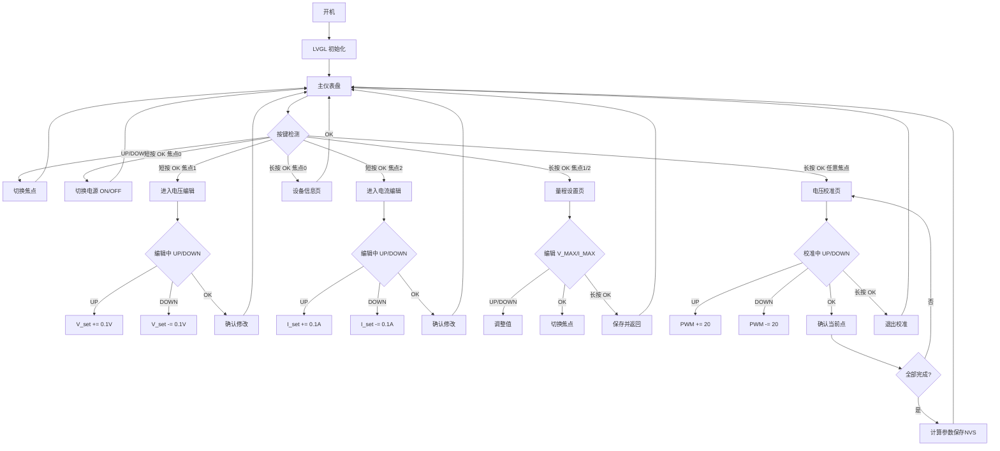

# LCD UI 完整重建设计方案

## 1. 概述

基于项目完整功能，重新设计所有 LCD 界面。当前只有一个主仪表盘界面，需要扩展为多界面系统，覆盖所有功能。

### 屏幕规格
- **驱动**: ST7789P3, 物理分辨率 240×296
- **LVGL 旋转**: 270° → 逻辑分辨率 **296×240** (横屏)
- **安全区**: 四边 10px 内边距 (物理圆角遮挡)
- **可用区域**: 276×220

### 字体 (LVGL 内置 montserrat, 不支持中文)
| 别名 | 实际字体 | 用途 |
|------|---------|------|
| `FONT_LARGE` | `montserrat_24` | 主数值 (电压/电流/功率) |
| `FONT_MEDIUM` | `montserrat_20` | 设定值、次级数值 |
| `FONT_SMALL` | `montserrat_14` | 标签、标题、按钮文字 |
| `FONT_TINY` | `montserrat_14` | 副标签、辅助信息 (同14) |

### 按键 (3 个物理按键, 低电平有效)
| 按键 | GPIO | 功能 |
|------|------|------|
| UP | GPIO18 | 焦点上移 / 编辑增加值 |
| DOWN | GPIO19 | 焦点下移 / 编辑减少值 |
| OK | GPIO20 | 进入编辑 / 确认 / 长按→校准 |

### 主题色板 (赛博控制台风格)
```cpp
#define C_BG        #0B1120  // 极深海军蓝 (背景)
#define C_CARD_BG   #1A233A  // 卡片背景
#define C_CARD_BDR  #334155  // 卡片边框
#define C_VOLTAGE   #FFFF00  // 黄色 (电压)
#define C_CURRENT   #00FFFF  // 青色 (电流)
#define C_POWER     #55AAFF  // 浅蓝 (功率)
#define C_GREEN     #00E676  // 亮绿 (输出ON/正常)
#define C_RED       #FF1744  // 亮红 (输出OFF/告警)
#define C_ORANGE    #FF9100  // 橙色 (警告)
#define C_GRAY      #78909C  // 蓝灰 (遥测文字)
#define C_DIM       #455A64  // 暗蓝灰 (标题/副标签)
#define C_WHITE     #FFFFFF
#define C_FOCUS_BDR #00FFFF  // 焦点边框 = 青色
#define C_EDIT_BG   #2A334A  // 编辑模式背景
#define C_EDIT_BDR  #FF9100  // 编辑模式边框 = 橙色
```

---

## 2. 界面总览 (共 5 个界面)

```
┌─────────────────────────────────────────────────┐
│  界面 1: 主仪表盘 (Main Dashboard)               │
│  ┌─────────────────────┬──────────────────────┐  │
│  │ LOAD METRICS        │ CONTROL TOWER        │  │
│  │  12.05 V            │ DELL POWER           │  │
│  │  5.20  A            │ ■ OUTPUT OFF         │  │
│  │  62.5  W            │ AC IN: 220V          │  │
│  │                     │ TEMP: 32 C           │  │
│  │                     │ FAN: 0 RPM           │  │
│  │                     │ Wh: 0  Ah: --        │  │
│  │                     │ ████████░░           │  │
│  ├─────────────────────┴──────────────────────┤  │
│  │  SET VOLTAGE         │  LIMIT CURRENT       │  │
│  │    12.00 V           │    5.000 A           │  │
│  └──────────────────────┴──────────────────────┘  │
│                                                   │
│  界面 2: 电压校准 (Voltage Calibration)            │
│  ┌──────────────────────────────────────────────┐ │
│  │  VOLTAGE CALIBRATION    Step 1/6             │ │
│  │  ┌────────────────────────────────────────┐  │ │
│  │  │  Target:  0.00V                        │  │ │
│  │  │  PWM:     1234  [UP/DOWN adjust]       │  │ │
│  │  │  ADC:     2048                         │  │ │
│  │  │  Actual:  0.00V                        │  │ │
│  │  └────────────────────────────────────────┘  │ │
│  │  [OK to Confirm]  [Long OK to Exit]          │ │
│  └──────────────────────────────────────────────┘ │
│                                                   │
│  界面 3: 电流校准 (Current Calibration)            │
│  ┌──────────────────────────────────────────────┐ │
│  │  CURRENT CALIBRATION    Step 1/6             │ │
│  │  ┌────────────────────────────────────────┐  │ │
│  │  │  Target:  0.0A                         │  │ │
│  │  │  PWM:     1234  [UP/DOWN adjust]       │  │ │
│  │  │  PMBus:   0.000A                       │  │ │
│  │  └────────────────────────────────────────┘  │ │
│  │  [OK to Confirm]  [Long OK to Exit]          │ │
│  └──────────────────────────────────────────────┘ │
│                                                   │
│  界面 4: 设备信息 (Device Info)                    │
│  ┌──────────────────────────────────────────────┐ │
│  │  DEVICE INFO                                 │ │
│  │  ┌────────────────────────────────────────┐  │ │
│  │  │  MFR:  Delta Electronics              │  │ │
│  │  │  Model: DPS-750AB                     │  │ │
│  │  │  Serial: ABC123456                    │  │ │
│  │  │  Rev: 01                              │  │ │
│  │  │  Date: 2023-01-15                     │  │ │
│  │  │  V_range: 0~12.0V                    │  │ │
│  │  │  I_range: 0~62.5A                    │  │ │
│  │  └────────────────────────────────────────┘  │ │
│  │  [OK to Return]                               │ │
│  └──────────────────────────────────────────────┘ │
│                                                   │
│  界面 5: 量程设置 (Range Settings)                 │
│  ┌──────────────────────────────────────────────┐ │
│  │  RANGE SETTINGS                              │ │
│  │  ┌────────────────────────────────────────┐  │ │
│  │  │  V_MAX:  12.0V  [UP/DOWN adjust]      │  │ │
│  │  │  I_MAX:  62.5A  [UP/DOWN adjust]      │  │ │
│  │  └────────────────────────────────────────┘  │ │
│  │  [OK to Save & Return]                        │ │
│  └──────────────────────────────────────────────┘ │
└─────────────────────────────────────────────────┘
```

---

## 3. 界面导航流程

```
┌──────────────┐
│  主仪表盘     │ ◄── 默认启动界面
│  (界面 1)    │
└──┬───┬───┬───┘
   │   │   │
   │   │   └── 长按 OK (2秒) ──► ┌──────────────┐
   │   │                         │ 电压校准      │
   │   │                         │ (界面 2)      │
   │   │                         └──────┬───────┘
   │   │                                │ 完成/退出
   │   │                                ▼
   │   │                         ┌──────────────┐
   │   │                         │ 主仪表盘      │
   │   │                         └──────────────┘
   │   │
   │   └── 焦点在 SET VOLTAGE ──► 按 OK 进入编辑模式
   │       编辑中再按 OK → 确认修改
   │       编辑中按 UP/DOWN → 增减 0.1V
   │
   ├── 焦点在 LIMIT CURRENT ──► 按 OK 进入编辑模式
   │       编辑中再按 OK → 确认修改
   │       编辑中按 UP/DOWN → 增减 0.1A
   │
   └── 焦点在状态卡片 ──► 按 OK 切换电源 ON/OFF
```

### 导航规则

| 操作 | 主仪表盘 | 校准界面 | 信息界面 | 量程设置 |
|------|---------|---------|---------|---------|
| **UP** | 焦点上移 | PWM 增加 | 无操作 | V_MAX 增加 |
| **DOWN** | 焦点下移 | PWM 减少 | 无操作 | V_MAX 减少 |
| **短按 OK** | 进入编辑/点击 | 确认当前点 | 返回主界面 | 切换到 I_MAX 编辑 |
| **长按 OK** | 进入电压校准 | 退出校准 | — | 保存并返回 |
| **焦点循环** | 3 个焦点循环 | 无焦点组 | 无焦点组 | 2 个焦点循环 |

---

## 4. 界面 1: 主仪表盘 (Main Dashboard)

### 布局 (与现有设计一致, 保留)

```
┌──────────────────────────────────────────────┐
│  ┌─────────────────────┬────────────────────┐ │
│  │ LOAD METRICS        │ CONTROL TOWER      │ │ ← TOP_H=165
│  │  12.05 V  (黄)      │ DELL POWER         │ │
│  │  5.20  A  (青)      │ ■ OUTPUT OFF       │ │
│  │  62.5  W  (蓝)      │ AC IN: 220V        │ │
│  │                     │ TEMP: 32 C         │ │
│  │                     │ FAN: 0 RPM         │ │
│  │                     │ Wh: 0  Ah: --      │ │
│  │                     │ ████████░░         │ │
│  ├─────────────────────┴────────────────────┤ │
│  │  SET VOLTAGE         │  LIMIT CURRENT     │ │ ← BOT_H=51
│  │    12.00 V           │    5.000 A         │ │
│  └──────────────────────┴────────────────────┘ │
│  ↑ 10px padding                                │
└────────────────────────────────────────────────┘
```

### 焦点组 (3 个对象)

| 焦点索引 | 对象 | 短按 OK 行为 | 编辑模式行为 |
|---------|------|-------------|-------------|
| 0 | 状态卡片 (右上) | 切换电源 ON/OFF | — |
| 1 | SET VOLTAGE 卡片 (左下) | 进入编辑 → UP/DOWN 调压 → OK 确认 | UP=+0.1V, DOWN=-0.1V |
| 2 | LIMIT CURRENT 卡片 (右下) | 进入编辑 → UP/DOWN 调流 → OK 确认 | UP=+0.1A, DOWN=-0.1A |

### 数据更新 (500ms 定时器)

| 字段 | 数据源 | 格式 |
|------|--------|------|
| V_out | `ADCSampler::getVoltage()` | `%.2f` |
| I_out | `PMBus::I_out` (经 `applyICalTable` 校准) | `%.2f` |
| W_out | `PMBus::W_out` | `%.0f` / `%.1f` / `%.2f` (自适应) |
| V_in | `PMBus::V_in` | `AC IN: %.0fV` |
| Temp | `PMBus::temperature[0/1]` | `TEMP: %.0f C` |
| Fan | `PMBus::fanSpeed[0]` | `FAN: %.0fRPM` |
| Energy | `PMBus::E_out` | `Wh: %.0f  Ah: --` |
| Load bar | `PMBus::W_out` | 范围 0~750W, 颜色渐变 |
| V_set | `PowerControl::getSetVoltage()` | `%.2f V` |
| I_set | `PowerControl::getSetCurrent()` | `%.3f A` |
| Output | `PowerControl::isPoweredOn()` | `▶ OUTPUT ON` (绿) / `■ OUTPUT OFF` (红) |
| PSU status | `PMBus::isDeviceOnline()` | `■ NO PSU` (红) 如果离线 |

---

## 5. 界面 2: 电压校准 (Voltage Calibration)

### 触发方式
- 主仪表盘 **长按 OK (2秒)** → 调用 `calibration_start()`
- 校准模块自动接管 UI

### 布局

```
┌──────────────────────────────────────────────┐
│  VOLTAGE CALIBRATION    Step 1/6             │ ← 标题行 (FONT_SMALL)
│  ┌──────────────────────────────────────────┐│
│  │  Target:  0.00V          (FONT_LARGE)    ││
│  │  PWM:     1234          (FONT_MEDIUM)    ││
│  │  ADC:     2048          (FONT_MEDIUM)    ││
│  │  Actual:  0.00V         (FONT_MEDIUM)    ││
│  │  ──────────────────────────────────────  ││
│  │  ▲ UP: PWM +20                           ││
│  │  ▼ DOWN: PWM -20                         ││
│  │  ● OK: Confirm this point                ││
│  │  ● Long OK: Exit calibration             ││
│  └──────────────────────────────────────────┘│
│  [Step 1/6] [████░░░░░░░░░░░░░░░░]          │ ← 进度条
└──────────────────────────────────────────────┘
```

### 数据更新 (200ms 定时器, 校准期间更快)

| 字段 | 数据源 |
|------|--------|
| Target | `g_calib_targets[step]` |
| PWM | `s_pwm` (当前调节值) |
| ADC | `ADCSampler::getRawAdc()` |
| Actual | `ADCSampler::getVoltage()` (校准后) |
| Progress | `(step+1) / CALIB_POINTS` |

### 按键行为

| 按键 | 功能 |
|------|------|
| UP | `s_pwm += PWM_STEP` (20), 电压升高 |
| DOWN | `s_pwm -= PWM_STEP` (20), 电压降低 |
| 短按 OK | 确认当前点 → 记录数据 → 进入下一步 |
| 长按 OK | 退出校准 (调用 `calibration_stop()`) |

### 完成时
- 自动计算 `mult` 和 `offset`
- 调用 `ADCSampler::calibrate(mult, offset)`
- 保存到 NVS
- 返回主仪表盘

---

## 6. 界面 3: 电流校准 (Current Calibration)

### 触发方式
- 从 BLE App 触发 (`{"cmd":"set_i_cal_table",...}`)
- LCD 上显示校准进度 (被动显示, 因为电流校准需要负载)

### 布局

```
┌──────────────────────────────────────────────┐
│  CURRENT CALIBRATION    Step 1/6             │ ← 标题行
│  ┌──────────────────────────────────────────┐│
│  │  Target:  0.0A          (FONT_LARGE)     ││
│  │  PWM:     1234          (FONT_MEDIUM)    ││
│  │  PMBus:   0.000A        (FONT_MEDIUM)    ││
│  │  ──────────────────────────────────────  ││
│  │  Status: Waiting for BLE...              ││
│  │  or: Adjusting via BLE...                ││
│  └──────────────────────────────────────────┘│
│  [Step 1/6] [████░░░░░░░░░░░░░░░░]          │
└──────────────────────────────────────────────┘
```

### 数据更新

| 字段 | 数据源 |
|------|--------|
| Target | `PMBus::I_CALIB_TARGETS[step]` |
| PWM | 当前 I_PWM 通道占空比 |
| PMBus | `PMBus::I_out` (原始值) |
| Progress | 从 `build_full_data_json()` 的 `i_cal_points` 解析 |

### 按键行为
- 电流校准主要通过 BLE App 控制
- LCD 上 UP/DOWN/OK 无操作 (显示提示)
- 长按 OK 可退出

---

## 7. 界面 4: 设备信息 (Device Info)

### 触发方式
- 主仪表盘焦点在状态卡片时, **长按 OK** (区别于短按切换电源)
- 或者: 在状态卡片焦点下, OK 短按切换电源, 长按进入信息页

### 布局

```
┌──────────────────────────────────────────────┐
│  DEVICE INFO              [OK to Return]     │ ← 标题行
│  ┌──────────────────────────────────────────┐│
│  │  ┌────────────────────────────────────┐  ││
│  │  │ MFR ID:  0x1D (Delta)             │  ││
│  │  │ Model:   DPS-750AB A              │  ││
│  │  │ Serial:  ABC123456                │  ││
│  │  │ Rev:     01                       │  ││
│  │  │ Date:    2023-01-15               │  ││
│  │  └────────────────────────────────────┘  ││
│  │                                           ││
│  │  ┌────────────────────────────────────┐  ││
│  │  │ V_range: 0~12.0V                  │  ││
│  │  │ I_range: 0~62.5A                  │  ││
│  │  │ V_mult: 1.0000  V_offset: 0.0000  │  ││
│  │  │ PSU Online: Yes                   │  ││
│  │  └────────────────────────────────────┘  ││
│  └──────────────────────────────────────────┘│
└──────────────────────────────────────────────┘
```

### 数据源
- `PMBus::mfrId`, `PMBus::mfrModel`, `PMBus::mfrSerial`
- `PMBus::mfrRevision`, `PMBus::mfrDate`
- `PowerControl::getVMax()`, `PowerControl::getIMax()`
- `ADCSampler::getCalMultiplier()`, `ADCSampler::getCalOffset()`
- `PMBus::isDeviceOnline()`

### 按键行为
| 按键 | 功能 |
|------|------|
| UP/DOWN | 无操作 |
| OK | 返回主仪表盘 |
| 长按 OK | 返回主仪表盘 |

---

## 8. 界面 5: 量程设置 (Range Settings)

### 触发方式
- 主仪表盘焦点在 SET VOLTAGE 或 LIMIT CURRENT 时, **长按 OK** (区别于短按进入编辑)

### 布局

```
┌──────────────────────────────────────────────┐
│  RANGE SETTINGS          [OK to Save]        │ ← 标题行
│  ┌──────────────────────────────────────────┐│
│  │  V_MAX:  12.0V         (FONT_LARGE)      ││
│  │  ▲ UP: +0.5V   ▼ DOWN: -0.5V            ││
│  │  ──────────────────────────────────────  ││
│  │  I_MAX:  62.5A         (FONT_LARGE)      ││
│  │  ▲ UP: +0.5A   ▼ DOWN: -0.5A            ││
│  │  ──────────────────────────────────────  ││
│  │  ● OK: Switch to I_MAX edit             ││
│  │  ● Long OK: Save & Return               ││
│  └──────────────────────────────────────────┘│
└──────────────────────────────────────────────┘
```

### 焦点组 (2 个对象)

| 焦点索引 | 对象 | 编辑行为 |
|---------|------|---------|
| 0 | V_MAX | UP=+0.5V, DOWN=-0.5V, 范围 0~12.0V |
| 1 | I_MAX | UP=+0.5A, DOWN=-0.5A, 范围 0~62.5A |

### 按键行为

| 按键 | 功能 |
|------|------|
| UP | 当前焦点值 +0.5 |
| DOWN | 当前焦点值 -0.5 |
| 短按 OK | 切换到下一个焦点 (V_MAX ↔ I_MAX) |
| 长按 OK | 保存并返回主仪表盘 |

### 保存
- 调用 `PowerControl::setVMax(vMax)` 和 `PowerControl::setIMax(iMax)`
- 自动同步到主仪表盘的电压/电流设定上限

---

## 9. 焦点导航与编辑模式详细设计

### 主仪表盘焦点状态机

```
                    ┌──────────────────┐
                    │  焦点 0: 状态卡片  │
                    │  (默认焦点)       │
                    └───────┬──────────┘
                            │
              ┌─────────────┼─────────────┐
              │             │             │
              ▼             │             ▼
    ┌─────────────────┐    │    ┌─────────────────┐
    │ 短按 OK: 切换电源 │    │    │ 长按 OK: 进入    │
    │ ON/OFF          │    │    │ 设备信息页       │
    └─────────────────┘    │    └─────────────────┘
                           │
              ┌────────────┴────────────┐
              ▼                         ▼
    ┌─────────────────┐      ┌─────────────────┐
    │ 焦点 1:          │      │ 焦点 2:          │
    │ SET VOLTAGE      │      │ LIMIT CURRENT    │
    └────────┬────────┘      └────────┬────────┘
             │                        │
    ┌────────┴────────┐     ┌────────┴────────┐
    │ 短按 OK: 进入    │     │ 短按 OK: 进入    │
    │ 编辑模式         │     │ 编辑模式         │
    │ UP/DOWN: ±0.1V  │     │ UP/DOWN: ±0.1A  │
    │ 再按 OK: 确认    │     │ 再按 OK: 确认    │
    │ 长按 OK: 进入    │     │ 长按 OK: 进入    │
    │ 量程设置         │     │ 量程设置         │
    └─────────────────┘     └─────────────────┘
```

### LV_STATE 样式

| 状态 | 边框颜色 | 边框宽度 | 背景色 |
|------|---------|---------|--------|
| 默认 | `#334155` | 1px | `#1A233A` |
| `LV_STATE_FOCUSED` | `#00FFFF` (青色) | 2px | `#1A233A` |
| `LV_STATE_EDITED` | `#FF9100` (橙色) | 2px | `#2A334A` |

### 编辑模式实现

当焦点对象进入 `LV_STATE_EDITED` 时:
1. UP/DOWN 不再切换焦点, 而是修改值
2. 值实时更新到标签
3. 按 OK 退出编辑模式 (确认修改)
4. 修改立即生效 (调用 `PowerControl::setVoltage/setCurrent`)

---

## 10. 实现计划

### 文件修改清单

| 文件 | 操作 | 说明 |
|------|------|------|
| `main/lvgl_ui.h` | 修改 | 添加新界面声明, 保留现有 API |
| `main/lvgl_ui.cpp` | 重写 | 实现所有 5 个界面 + 导航状态机 |
| `main/main.cpp` | 修改 | 更新 `handle_buttons()` 支持多界面导航 |
| `main/calibration.cpp` | 修改 | 添加 LVGL 校准 UI 创建/销毁 (当前只有 BLE 控制) |

### 新增模块

| 文件 | 说明 |
|------|------|
| `main/lvgl_ui.h` | 界面枚举 + 公共 API |
| `main/lvgl_ui.cpp` | 所有界面实现 (~800 行) |

### 核心 API 设计

```cpp
// lvgl_ui.h
typedef enum {
    LVGL_SCREEN_MAIN,           // 主仪表盘
    LVGL_SCREEN_VOLT_CALIB,     // 电压校准
    LVGL_SCREEN_CURR_CALIB,     // 电流校准
    LVGL_SCREEN_DEVICE_INFO,    // 设备信息
    LVGL_SCREEN_RANGE_SETTINGS, // 量程设置
} lvgl_screen_t;

void lvgl_ui_init(void);
void lvgl_ui_deinit(void);
bool lvgl_ui_is_ready(void);
void lvgl_ui_handle_key(lvgl_key_t key);

// 界面切换
void lvgl_ui_switch_to(lvgl_screen_t screen);

// 校准 UI (由 calibration_start/stop 调用)
void lvgl_ui_show_calibration(void);
void lvgl_ui_hide_calibration(void);
void lvgl_ui_update_calibration(int step, int pwm, int adc, float actual);
```

### 实现步骤

1. **重构 `lvgl_ui.h`** — 添加界面枚举和新 API 声明
2. **重写 `lvgl_ui.cpp`** — 实现所有 5 个界面
   - 主仪表盘 (保留现有代码)
   - 电压校准界面
   - 电流校准界面
   - 设备信息界面
   - 量程设置界面
   - 界面切换逻辑
   - 焦点导航状态机
3. **修改 `calibration.cpp`** — 添加 LVGL UI 创建/销毁调用
4. **修改 `main.cpp`** — 更新按键处理支持多界面导航
5. **编译测试** — 验证所有界面切换和按键交互

---

## 11. 关键实现细节

### 界面切换策略

使用 LVGL 的 `lv_obj_clean(lv_screen_active())` 清空当前界面, 然后重新创建。或者使用多个 `lv_scr` (screen) 对象切换。推荐使用单 screen + 清空重建, 因为:
- 内存占用更低 (一次只存在一个界面)
- 逻辑简单 (不需要管理多个 screen)
- 适合 296x240 小屏幕

### 校准 UI 集成

当前 `calibration.cpp` 的 `calibration_start/stop` 没有 LVGL UI 交互。需要:
1. `calibration_start()` → 调用 `lvgl_ui_switch_to(LVGL_SCREEN_VOLT_CALIB)`
2. `calibration_stop()` → 调用 `lvgl_ui_switch_to(LVGL_SCREEN_MAIN)`
3. 校准按键处理 → 通过 `lvgl_ui_handle_key()` 路由到校准模块

### 长按检测

在 `handle_buttons()` 中:
- 主仪表盘: 长按 OK 2秒 → 进入电压校准
- 状态卡片焦点: 长按 OK → 进入设备信息
- SET VOLTAGE/LIMIT CURRENT 焦点: 长按 OK → 进入量程设置
- 校准界面: 长按 OK → 退出校准

### 编辑模式

LVGL 的 `LV_STATE_EDITED` 用于编辑模式:
- 焦点对象收到 `LV_KEY_ENTER` 时, 如果当前是 `LV_STATE_FOCUSED`, 切换到 `LV_STATE_EDITED`
- 编辑模式下, UP/DOWN 发送 `LV_KEY_LEFT/RIGHT` (或自定义处理)
- 再次按 `LV_KEY_ENTER` 退出编辑模式

---

## 12. Mermaid 流程图


